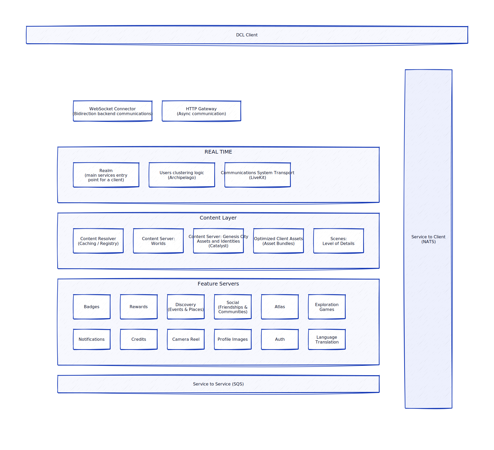

# Decentraland Architecture 

This repository aims to have the main Decentraland Architecture, defined using [dot language](https://graphviz.org/doc/info/lang.html). The goal is to help you understand it's components, responsibilities, how they interact and help you navigate through them. 

## Catalyst

A Catalyst is a server that runs different services. These services currently work as the backbone for Decentraland. Some of these project are:

- [Comms / Lighthouse](https://github.com/decentraland/catalyst/tree/main/lambdas)
- [Lambdas](https://github.com/decentraland/catalyst/tree/main/lambdas)
- [Content Server](https://github.com/decentraland/catalyst/tree/main/content)

If you just want to run a Catalyst server, please check the [Catalyst Owner](https://github.com/decentraland/catalyst-owner) repository. 
You can check the list of available servers used by Decentraland in the [Catalyst Monitor](https://catalyst-monitor.vercel.app/)

### Comms

The Communication Service, also known as Lighthouse, is in charge of orchestrating the P2P networks between users connected to Decentraland. 
It needs to determine which are the candidates for a P2P connection and do the WebRTC signaling to establish the connection. Most of this logic is done through 2 external components the [PeerJS Server](https://github.com/decentraland/peerjs-server) (connects WebRTC peers) and [Archipelago](https://github.com/decentraland/archipelago) (receives users positions and groups them in islands)

### Lambdas 

This service provides a set of utilities required by the Catalyst Server Clients/Consumers in order to retrieve or validate data.
Some of the validations run in these functions are ownership related and for that it uses [The Graph](https://thegraph.com/hosted-service/subgraph/decentraland/collections-matic-mainnet) to query the blockchain. 

### Content Server 

The Content Server currently stores many of the [Entities](https://github.com/decentraland/common-schemas/tree/main/src/platform) used in Decentraland. For example scenes, wearables and profiles. Content servers will automatically sync with each other, as long as they were all approved by the [DAO](http://governance.decentraland.org/).

If you set up a local content server, it will receive all updates by those other DAO Catalysts. However, new deployments that happen on your local server will not be sent to other servers.

### Nginx

Reverse proxy to route traffic to the Catalysts Services.

## CLI

This [CLI](https://github.com/decentraland/cli) provides tooling/commands to assist you in the [scenes](https://github.com/decentraland-scenes/Awesome-Repository) development process. Some of the commands will help you scaffold a new scene project, locally start and visualize the scene in order to test it and deploy it to a content server to be incorporated in your Decentraland parcel.

## Catalyst Client

This client [library](https://github.com/decentraland/catalyst-client) can be used to interact with Decentraland's Catalyst servers. You can both fetch data, or deploy new entities to the server you specify.

## Web Browser

### Peer Library 

The [Peer Library](https://github.com/decentraland/catalyst-comms-peer) manages Websocket connections for WebRTC signaling, Islands, Notifications and Location Data and WebRTC Connections for peers positions, scene bus, global chat and voice chat (private chat goes through the Matrix Synapse Server and the Matrix Client). 

### Voice Chat Module 

This [Module](https://github.com/decentraland/explorer/tree/af59463dd3882516874c86bc926726bc557d5184/kernel/packages/voice-chat-codec) is the codec to hook WebAudio & Worklets to comms

### Client Comms 

[Abstraction](https://github.com/decentraland/explorer/tree/df1d30412dcd1a94d933171a39796837aedc87a1/kernel/packages/shared/comms) over the Communication Protocol 

### Scene Loader System

[Module](https://github.com/decentraland/explorer/tree/df1d30412dcd1a94d933171a39796837aedc87a1/kernel/packages/decentraland-loader) to Loads and unloads the scenes/parcels based on user position.

### Scene 

High level [wrapper](https://github.com/decentraland/explorer/blob/af59463dd3882516874c86bc926726bc557d5184/kernel/packages/unity-interface/UnityScene.ts#L19) around the runtime scene  

### Avatar Scene

It is a regular Decentraland [Scene](https://github.com/decentraland/explorer/blob/af59463dd3882516874c86bc926726bc557d5184/kernel/packages/ui/avatar/avatarSystem.ts), it has the size of the world. And it renders the avatars using the SDK

### Matrix Client 

The [Matrix Client](https://github.com/decentraland/matrix-client) can be used to interact Decentraland's users, providing the ability to send private messages and add people as friends.

### Sagas 

Like an ESB. Everything is connected to Sagas

### Synapse

[Synapse](https://matrix.org/docs/projects/server/synapse) server is an implementation of the [Matrix Protocol](https://matrix.org/), created for secure, decentralized communications. In the context of Decentraland it is used to manage private chats between peers and friendships. 

## Explorer Website

[REACT Application](https://github.com/decentraland/explorer-website) to load Kernel and Renderer

## Scene Runtime 

### Runtime 

The [Runtime](https://github.com/decentraland/explorer/blob/df1d30412dcd1a94d933171a39796837aedc87a1/kernel/packages/scene-system/sdk/SceneRuntime.ts) handles SDK bindings and messaging with the Scene in Kernel

### Compiler Bundle 

#### AMD
This [Module](https://github.com/decentraland/js-sdk-toolchain/tree/c648dcabc0ac1aade3cf143769f7e7f67ffba95b/packages/%40dcl/amd) manages loading of RPC modules to interact with different components of Decentraland

#### ECS
The public library to interact with Decentraland. Sometimes people refers to the ECS as “The SDK”

#### User Code
The user generated code is part of the bundle of the Scenes

# How to Update this Repository

The architecture is something live and from time to time we may need to update this diagram and information, in order to do so the file [architecture.dot](architecture.dot) contains the definition of the image [architecture.svg](architecture.svg). It can be a bit challenging to update and make it look nice, the VSCode extension [Graphviz Interactive Preview](https://marketplace.visualstudio.com/items?itemName=tintinweb.graphviz-interactive-preview) can be very helpful to view your changes as you make them. 
Once the architecture dot file is updated you need to compile it and regenerate the architecture.svg file, for that you first need to [install graphviz](https://graphviz.org/download/) and then you can just run the `make` command. Note that with any change on the diagram you need to validate that this readme describing it's components is still updated. 
