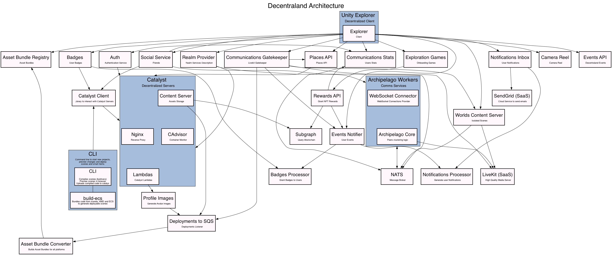

# Decentraland Architecture

This repository contains the main Decentraland Architecture diagram, defined using [D2 language](https://d2lang.com). The goal is to help you understand its components, responsibilities, how they interact, and help you navigate through them.

You will find the documentation index [here](docs/dcl-architecture.md) and, also, the content of this repository is published on the [Technical Documentation Site](https://docs.decentraland.org/contributor/).

## Architecture Layers

The Decentraland backend architecture is organized into four distinct layers, each serving a specific purpose:



### 1. Entry Points Layer: Client Communication

**Purpose**: Provides two distinct entry points for Decentraland clients to interact with backend services.

**Entry Point 1: WebSocket Connector (Bidirectional)**

**Components**:
- **WebSocket Connector** (`archipelago-workers/ws-connector`): Manages WebSocket connections with Decentraland clients
- **NATS Messaging**: Message broker that routes service-to-client communications

**Communication Flow**:
```
Feature Service → NATS → WebSocket Connector → Decentraland Client
```

**Key Principles**:
- **Bidirectional**: Clients can send requests, services can push updates
- **Proactive Notifications**: Services can push updates to clients without polling
- **Event-Driven**: Services publish messages to NATS, WebSocket connector delivers to clients
- **Real-Time**: Immediate delivery of updates to clients

**When to Use**:
- New scene version available
- New notification received
- Reward granted
- Profile image updated
- Any event that requires immediate client awareness

**Important**: If a feature service needs to communicate with clients proactively, it **must** use NATS to send messages to the WebSocket connector. Do **not** implement HTTP polling strategies for push notifications.

**Entry Point 2: HTTP Gateway (Polling - Not Bidirectional)**

**Components**:
- **HTTP Gateway**: Common entry point for client HTTP requests
- **Feature Services**: Business logic services accessible via HTTP
- **Content Services**: Content layer services (Catalyst, Worlds, Registry)

**Communication Flow**:
```
Decentraland Client → HTTP Gateway → Feature/Content Service
```

**Key Principles**:
- **Unidirectional**: Client initiates requests, services respond
- **Polling Pattern**: Clients poll services for information
- **HTTP/2 Multiplexing**: Gateway enables efficient multiple concurrent requests
- **REST APIs**: Services expose RESTful endpoints

**When to Use**:
- Fetching user data (profiles, settings, inventory)
- Querying content (scenes, wearables, entities)
- Retrieving marketplace data
- Getting realm information
- Any request-response pattern where client initiates

**Important**: HTTP Gateway is for client-initiated requests only. It does not support server-to-client push notifications. For proactive updates, use the WebSocket connector.

**Example Use Cases**:
- `events-notifier` publishes event notifications via NATS → WebSocket connector → client
- `notifications-workers` sends notification updates to clients
- `badges` notifies clients when new badges are granted
- `profile-images` alerts clients when new profile images are ready

### 2. Real-Time Layer: User-to-User Communication

**Purpose**: Handles real-time data exchange between users in the Decentraland metaverse.

**Components**:
- **LiveKit**: WebRTC-based Selective Forwarding Unit (SFU) for real-time communication
- **Archipelago Workers**: Manages peer clustering and island assignments
- **Comms Services**: Various services handling different communication aspects

**Transport**: LiveKit (primary transport for real-time communication)

**Supported Real-Time Features**:
- **User Positions**: Spatial positioning and movement tracking
- **Chat Messages**: Text communication between users
- **Emotes**: Avatar animations and expressions
- **Voice Chat**: Real-time voice communication
- **Streaming**: Video/audio streaming capabilities

**Key Services**:
- `archipelago-workers`: Peer clustering and island management
- `comms-gatekeeper`: Access control and scene-based communication rules
- `comms-message-sfu`: Message routing and validation for LiveKit
- `police-server`: Content moderation for LiveKit rooms

**Architecture Pattern**:
- Users connect to LiveKit rooms based on their location/island assignment
- Archipelago workers manage island assignments and peer clustering
- Comms services handle routing, validation, and moderation

**When Working on Real-Time Features**:
- Consider LiveKit room management
- Understand island/peer clustering logic
- Account for access control and moderation
- Handle WebSocket connections for real-time updates

### 3. Content Layer: Content Registry & Processing

**Purpose**: Provides centralized access to processed Decentraland content with eventual consistency guarantees.

**Components**:
- **Asset Bundle Registry** (`asset-bundle-registry`): Centralized cache for processed content
- **Catalyst Content Servers** (`catalyst`): Stores raw entity content
- **Worlds Content Server** (`worlds-content-server`): Stores world-specific content
- **Asset Bundle Converter** (`asset-bundle-converter`): Processes content into optimized formats

**Content Processing Pipeline**:
```
Raw Content (Catalyst/Worlds) 
  → Asset Bundle Conversion 
  → LOD Generation 
  → Registry Storage 
  → Client Access
```

**Key Principles**:
- **Centralized Cache**: Registry acts as single source of truth for processed content
- **Processing Required**: Most content must be converted to asset bundles (AB) and LODs
- **Eventual Consistency**: Registry solves consistency issues in multiplayer experiences
- **Multi-Format Support**: Content is processed into multiple formats/quality levels

**Important Considerations**:
⚠️ **When adding support for a new entity type**:
1. Ensure the entity can be processed into asset bundles
2. Update the asset bundle converter to handle the new type
3. Configure the registry to cache the new entity type
4. Update LOD generation if applicable
5. Consider multiplayer consistency requirements

**Content Flow**:
- Content uploaded to Catalyst/Worlds → Processing triggered → Asset bundles generated → Stored in registry → Accessed by clients
- Clients access content through the registry, not directly from Catalyst/Worlds

**Services in This Layer**:
- `asset-bundle-registry`: Main registry service
- `asset-bundle-converter`: Content processing
- `catalyst`: Content storage (raw)
- `worlds-content-server`: World content storage

### 4. Feature Servers Layer: Business Logic

**Purpose**: Implements business functionality accessible to clients through the HTTP Gateway (see Entry Points Layer).

**Components**:
- **Feature Services**: Individual services providing specific functionality
- **AWS SQS**: Event-driven communication between services

**Communication Patterns**:

**Client-to-Service** (HTTP - via Entry Points Layer):
```
Decentraland Client → HTTP Gateway → Feature Service
```
- All feature services are accessed through the HTTP Gateway (Entry Points Layer)
- Gateway enables HTTP/2 multiplexing for efficient client connections
- Services expose REST APIs
- **Note**: This is unidirectional (client polls, service responds). For bidirectional communication, use WebSocket Connector.

**Service-to-Service** (Event-Driven):
```
Service A → AWS SQS → Service B (subscribes to event family)
```
- Services publish events to AWS SQS
- Services subscribe to event families they need
- Asynchronous, decoupled communication

**Example Inter-Service Communication**:
- `events` service may need information from `social-service-ea` to send notifications
- `events-notifier` publishes events that `notifications-workers` consumes
- `badges` processes events from various sources

**Key Principles**:
- **HTTP Gateway**: Single entry point for all client requests
- **Event-Driven**: Services communicate via events, not direct HTTP calls
- **Decoupled**: Services are independent and communicate asynchronously
- **Event Families**: Services subscribe to families of related events

**Feature Services Include**:
- `social-service-ea`: Social interactions (friends, communities, blocks)
- `marketplace-server`: NFT marketplace functionality
- `events`: Event management
- `badges`: Badge system
- `credits-server`: Credits management
- `auth-server`: Authentication
- `realm-provider`: Realm information
- And many more...

## How to Update this Repository

The architecture is something live and from time to time we may need to update this diagram and information.

### Prerequisites

Install D2 by following the [official installation guide](https://d2lang.com/tour/install):

```bash
# macOS
brew install d2

# Linux
curl -fsSL https://d2lang.com/install.sh | sh -s --

# Other methods: https://d2lang.com/tour/install
```

### Editing the Diagram

The file [architecture.d2](architecture.d2) contains the diagram definition. D2 uses a simple, human-readable syntax:

```d2
service-name: Service Label {
  tooltip: "Description of the service"
  link: https://github.com/decentraland/repo-name

  sub-component: Sub Component {
    tooltip: "Description"
  }
}

service-name -> other-service
```

**Recommended VS Code extension**: [D2 Extension](https://marketplace.visualstudio.com/items?itemName=terrastruct.d2) for syntax highlighting and live preview.

### Generating the Architecture Image

Once the D2 file is updated, regenerate the architecture image:

```bash
make architecture
```

This will produce both `docs/architecture.svg` and `docs/architecture.png`.

> **Note**: With any change to the diagram, make sure the [documentation](docs/dcl-architecture.md) describing its components is still up to date.

### D2 Resources

- [D2 Tour](https://d2lang.com/tour/intro) - Learn the language basics
- [D2 Playground](https://play.d2lang.com) - Try D2 in the browser
- [D2 Examples](https://d2lang.com/tour/layouts) - Layout and styling examples
